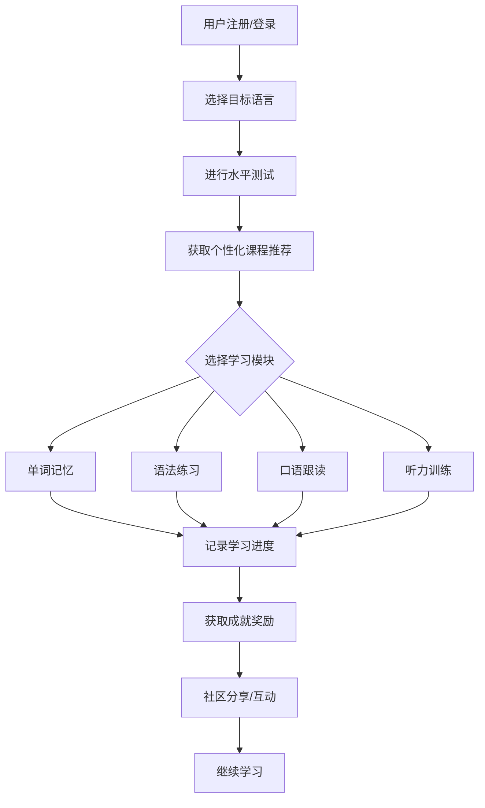

## 1. Product Overview
多语种在线教育平台，支持英语、日语、韩语等主流语言学习，打造沉浸式语言学习体验。
- 核心价值：提供分级课程、互动学习、进度追踪、个性化推荐等功能
- 目标用户：语言学习者，从初学者到进阶用户

## 2. Core Features

### 2.1 User Roles
| Role | Registration Method | Core Permissions |
|------|---------------------|------------------|
| Normal User | Email/Social registration | Browse courses, learn, track progress, join community |
| Admin | Manual setup | Manage courses, users, content |

### 2.2 Feature Module
1. **首页**: 语言选择、课程推荐、学习进度概览
2. **课程中心**: 分级课程体系、课程详情、开始学习
3. **学习模块**: 单词记忆、语法练习、口语跟读、听力训练
4. **学习进度**: 进度追踪、成就展示、学习统计
5. **社区**: 学习论坛、交流互动、成就激励
6. **个人中心**: 用户信息、学习档案、设置

### 2.3 Page Details
| Page Name | Module Name | Feature description |
|-----------|-------------|---------------------|
| 首页 | Hero区域 | 语言选择器、今日学习目标、推荐课程 |
| 首页 | 课程推荐 | 根据用户水平推荐合适课程 |
| 课程中心 | 课程列表 | 按语言/级别分类的课程卡片 |
| 课程中心 | 课程详情 | 课程介绍、章节列表、开始学习按钮 |
| 学习模块 | 单词记忆 | 闪卡式记忆、拼写练习 |
| 学习模块 | 语法练习 | 选择题、填空题、即时反馈 |
| 学习模块 | 口语跟读 | 语音录制、发音评分 |
| 学习模块 | 听力训练 | 音频播放、听写练习 |
| 学习进度 | 进度追踪 | 学习时长、完成课程数、每日目标 |
| 学习进度 | 成就系统 | 徽章、等级、排行榜 |
| 社区 | 论坛 | 帖子列表、评论互动 |
| 社区 | 讨论区 | 话题分类、热门讨论 |
| 个人中心 | 用户信息 | 头像、昵称、学习时长统计 |
| 个人中心 | 学习档案 | 历史记录、收藏课程 |

## 3. Core Process

## 4. User Interface Design

### 4.1 Design Style
- **主色调**: 渐变蓝紫色 (#667eea → #764ba2)，传达知识与创新感
- **辅助色**: 活力橙 (#f59e0b) 用于强调和CTA按钮
- **按钮风格**: 圆角 (12px)、渐变背景、hover效果
- **字体**: 标题使用 'Playfair Display'，正文使用 'Inter'
- **布局**: 卡片式设计、左侧导航、响应式布局
- **图标风格**: 线性图标 (Lucide React)

### 4.2 Page Design Overview
| Page Name | Module Name | UI Elements |
|-----------|-------------|-------------|
| 首页 | Hero区域 | 渐变背景、语言选择下拉框、学习目标进度条 |
| 首页 | 课程推荐 | 横向滚动卡片列表、课程封面、难度标签 |
| 课程中心 | 课程列表 | 网格布局、筛选器、搜索框 |
| 学习模块 | 单词卡片 | 翻转动画、发音按钮、收藏功能 |
| 学习进度 | 仪表盘 | 环形进度图、统计卡片、成就徽章网格 |
| 社区 | 论坛 | 帖子卡片、点赞评论按钮、分页导航 |

### 4.3 Responsiveness
- Desktop-first设计
- 平板端：双栏布局
- 移动端：单栏布局、底部导航栏

### 4.4 3D Scene Guidance
- 首页Hero区域添加浮动的语言图标3D效果
- 学习完成时的庆祝动画效果
