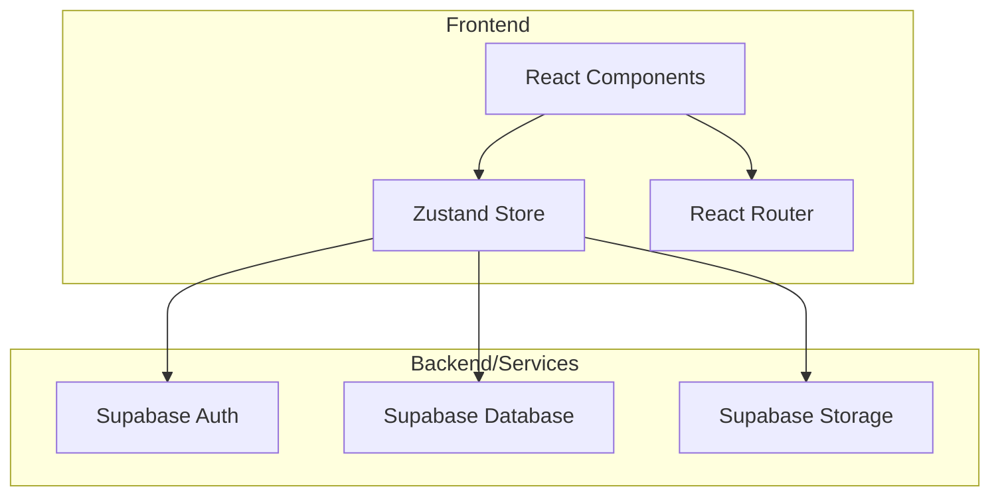
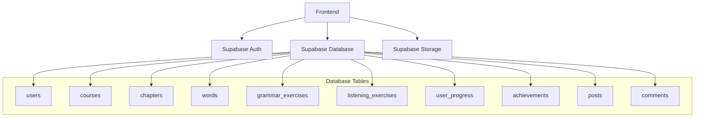
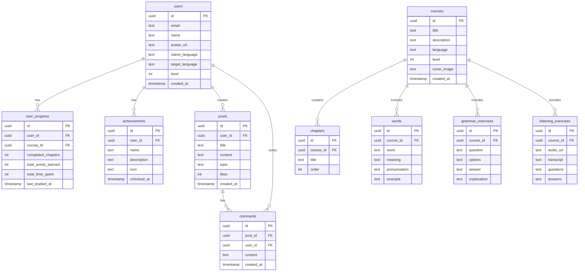

## 1. Architecture Design



## 2. Technology Description
- **Frontend**: React@18 + TypeScript + Vite@6 + TailwindCSS@3
- **State Management**: Zustand
- **Routing**: React Router DOM@6
- **Icons**: Lucide React
- **Backend**: Supabase (Auth, Database, Storage)
- **Initialization Tool**: vite-init

## 3. Route Definitions
| Route | Purpose |
|-------|---------|
| `/` | 首页 - 语言选择、课程推荐 |
| `/courses` | 课程中心 - 分级课程列表 |
| `/courses/:id` | 课程详情页 |
| `/learn/words` | 单词记忆模块 |
| `/learn/grammar` | 语法练习模块 |
| `/learn/speaking` | 口语跟读模块 |
| `/learn/listening` | 听力训练模块 |
| `/progress` | 学习进度追踪 |
| `/community` | 社区交流 |
| `/profile` | 个人中心 |
| `/auth/login` | 登录页面 |
| `/auth/register` | 注册页面 |

## 4. API Definitions

### Auth APIs (Supabase)
- `signUp(email, password)` - 用户注册
- `signIn(email, password)` - 用户登录
- `signOut()` - 用户退出
- `updateProfile(data)` - 更新用户资料

### Course APIs
- `getCourses(language?, level?)` - 获取课程列表
- `getCourseById(id)` - 获取课程详情
- `getCourseChapters(courseId)` - 获取课程章节

### Learning APIs
- `getWords(level, count)` - 获取单词列表
- `getGrammarExercises(level, count)` - 获取语法练习
- `getListeningExercises(level, count)` - 获取听力练习
- `recordProgress(userId, data)` - 记录学习进度
- `getUserProgress(userId)` - 获取用户学习进度

### Community APIs
- `getPosts(topic?)` - 获取帖子列表
- `createPost(data)` - 创建帖子
- `getComments(postId)` - 获取评论
- `createComment(data)` - 创建评论

### Achievement APIs
- `getAchievements(userId)` - 获取用户成就
- `unlockAchievement(userId, achievementId)` - 解锁成就

## 5. Server Architecture Diagram



## 6. Data Model

### 6.1 Data Model Definition



### 6.2 Data Definition Language

```sql
CREATE TABLE users (
    id UUID PRIMARY KEY DEFAULT uuid_generate_v4(),
    email TEXT UNIQUE NOT NULL,
    name TEXT NOT NULL,
    avatar_url TEXT,
    native_language TEXT DEFAULT 'zh-CN',
    target_language TEXT DEFAULT 'en',
    level INT DEFAULT 1,
    created_at TIMESTAMP DEFAULT NOW()
);

CREATE TABLE courses (
    id UUID PRIMARY KEY DEFAULT uuid_generate_v4(),
    title TEXT NOT NULL,
    description TEXT,
    language TEXT NOT NULL,
    level INT NOT NULL,
    cover_image TEXT,
    created_at TIMESTAMP DEFAULT NOW()
);

CREATE TABLE chapters (
    id UUID PRIMARY KEY DEFAULT uuid_generate_v4(),
    course_id UUID REFERENCES courses(id),
    title TEXT NOT NULL,
    "order" INT NOT NULL
);

CREATE TABLE words (
    id UUID PRIMARY KEY DEFAULT uuid_generate_v4(),
    course_id UUID REFERENCES courses(id),
    word TEXT NOT NULL,
    meaning TEXT NOT NULL,
    pronunciation TEXT,
    example TEXT
);

CREATE TABLE grammar_exercises (
    id UUID PRIMARY KEY DEFAULT uuid_generate_v4(),
    course_id UUID REFERENCES courses(id),
    question TEXT NOT NULL,
    options TEXT[],
    answer TEXT NOT NULL,
    explanation TEXT
);

CREATE TABLE listening_exercises (
    id UUID PRIMARY KEY DEFAULT uuid_generate_v4(),
    course_id UUID REFERENCES courses(id),
    audio_url TEXT NOT NULL,
    transcript TEXT NOT NULL,
    questions TEXT[],
    answers TEXT[]
);

CREATE TABLE user_progress (
    id UUID PRIMARY KEY DEFAULT uuid_generate_v4(),
    user_id UUID REFERENCES users(id),
    course_id UUID REFERENCES courses(id),
    completed_chapters INT DEFAULT 0,
    total_words_learned INT DEFAULT 0,
    total_time_spent INT DEFAULT 0,
    last_studied_at TIMESTAMP
);

CREATE TABLE achievements (
    id UUID PRIMARY KEY DEFAULT uuid_generate_v4(),
    user_id UUID REFERENCES users(id),
    name TEXT NOT NULL,
    description TEXT,
    icon TEXT,
    unlocked_at TIMESTAMP DEFAULT NOW()
);

CREATE TABLE posts (
    id UUID PRIMARY KEY DEFAULT uuid_generate_v4(),
    user_id UUID REFERENCES users(id),
    title TEXT NOT NULL,
    content TEXT NOT NULL,
    topic TEXT,
    likes INT DEFAULT 0,
    created_at TIMESTAMP DEFAULT NOW()
);

CREATE TABLE comments (
    id UUID PRIMARY KEY DEFAULT uuid_generate_v4(),
    post_id UUID REFERENCES posts(id),
    user_id UUID REFERENCES users(id),
    content TEXT NOT NULL,
    created_at TIMESTAMP DEFAULT NOW()
);

GRANT SELECT ON users TO anon;
GRANT SELECT ON courses TO anon;
GRANT SELECT ON chapters TO anon;
GRANT SELECT ON words TO anon;
GRANT SELECT ON grammar_exercises TO anon;
GRANT SELECT ON listening_exercises TO anon;

GRANT ALL PRIVILEGES ON users TO authenticated;
GRANT ALL PRIVILEGES ON courses TO authenticated;
GRANT ALL PRIVILEGES ON chapters TO authenticated;
GRANT ALL PRIVILEGES ON words TO authenticated;
GRANT ALL PRIVILEGES ON grammar_exercises TO authenticated;
GRANT ALL PRIVILEGES ON listening_exercises TO authenticated;
GRANT ALL PRIVILEGES ON user_progress TO authenticated;
GRANT ALL PRIVILEGES ON achievements TO authenticated;
GRANT ALL PRIVILEGES ON posts TO authenticated;
GRANT ALL PRIVILEGES ON comments TO authenticated;
```
